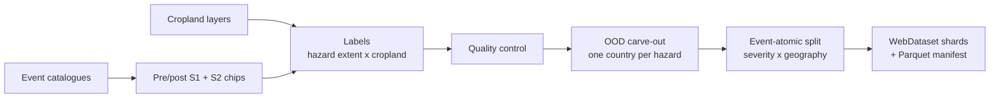
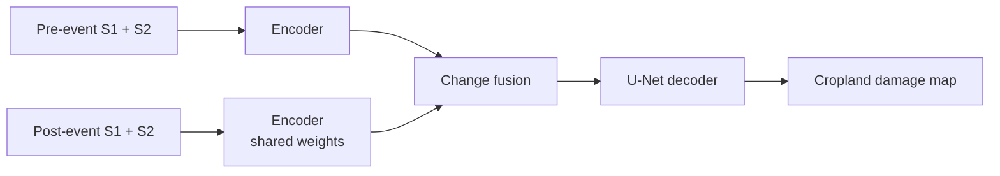

# CropDamage Benchmark

**A multi-hazard benchmark for mapping disaster damage to cropland with geospatial foundation models, evaluated on disaster events and regions the model has never seen.**

Disasters are mapped routinely; what they do to the land people depend on is not. Existing Earth-observation disaster datasets centre on buildings (xBD, BRIGHT) or on flood and burn-scar *extent*, and foundation-model benchmarks (GEO-Bench, PANGAEA, GEO-Bench-2) inherit the same tasks. Agricultural impact, the pathway through which most hazards reach food security, livelihoods and public health, is not represented.

CropDamage Benchmark pairs bi-temporal Sentinel-1 and Sentinel-2 imagery with pixel-level labels of *damaged versus unaffected cropland*, and asks one question: how well does a model trained on past events map damage from an event, or a country, it was never shown?

## Key contributions

- **A global, multi-hazard cropland-damage dataset.** 9,888 chips from 2,760 flood and burnt-area events (2020 to early 2026) across 33 and 62 countries, each with pre- and post-event Sentinel-1 SAR and Sentinel-2 optical imagery at 10 m.
- **Impact labels, not only extent.** Hazard footprints are intersected with cropland layers (USDA CDL, ESA WorldCover), so models are trained and scored on damaged versus unaffected cropland, with a continuous damage fraction per chip for severity analysis.
- **A leakage-controlled generalization protocol.** Splits are event-disjoint and jointly stratified by severity and geography, and a whole country per hazard is held out as an out-of-distribution test. The headline metric is averaged over events, with bootstrap confidence intervals.
- **A unified, encoder-agnostic model.** One Siamese encoder, change-fusion and decoder design, and one tuning budget, are shared by every foundation model, so differences in results reflect the pretrained representation.
- **A hazard-agnostic pipeline.** Data format, split procedure, loader and model interface are independent of the hazard and of the exposure layer, so new hazards and new exposure targets are added as data.

## Benchmark at a glance

| | Flood | Burnt |
|---|---|---|
| Events / chips | 1,297 / 5,102 | 1,463 / 4,786 |
| Countries | 33 | 62 |
| Train / val / test events | 767 / 258 / 251 | 863 / 288 / 290 |
| OOD hold-out | Philippines, 21 events | South Africa, 22 events |

| | |
|---|---|
| **Inputs** | Sentinel-2 L2A (12 bands) and Sentinel-1 GRD (VV, VH), before and after the event, 512 × 512 px at 10 m |
| **Labels** | Damaged cropland, unaffected cropland; excluded and non-cropland pixels are ignored |
| **Encoders** | TerraMind, Prithvi-EO-2.0, CROMA, AlphaEarth Foundations (planned), and a U-Net trained from scratch |
| **Dataset** | [huggingface.co/datasets/eadrah/AgDamage_Benchmark](https://huggingface.co/datasets/eadrah/AgDamage_Benchmark) |

## Data pipeline



Chips are grouped into events, and every split assigns whole events, because chips from one disaster share acquisition dates, phenology and terrain. An isolated country with a representative severity distribution is removed first as the out-of-distribution hold-out. The remaining events are split 60 / 20 / 20 within strata formed by severity quartile and continental region. The split is frozen in the manifest and checked for event leakage.

## Model



Both dates pass through one encoder with shared weights, frozen by default. Features are fused at each encoder level (difference, concatenation, or cross-attention between dates) and decoded by a U-Net head. Per-encoder input adapters handle band selection, so the training loop is identical for every model.

## Evaluation

- **Task.** Per-pixel segmentation of damaged versus unaffected cropland from the bi-temporal pair. Change detection is planned as a second task.
- **Metrics.** IoU and F1 on the damaged class, macro-averaged over events (headline) with 95 % bootstrap confidence intervals, plus pixel-pooled micro scores.
- **Test sets.** Unseen events from seen regions, and a fully unseen country.
- **Model selection.** Hyperparameters are tuned on validation only, with the same W&B search space and budget for every encoder. Test and hold-out sets are evaluated once, on the selected checkpoint.

## Extending the benchmark

A new hazard needs an event catalogue, pre- and post-event imagery, a label formed by intersecting the hazard footprint with an exposure layer, and a per-chip severity value. The existing scripts then produce the stratified, event-disjoint split and regional hold-out, and the hazard is selected in a config with `hazards: [<Name>]`.

- **Further hazards.** Landslides and conflict damage fit the bi-temporal format directly. Slow-onset and land-surface hazards, such as agricultural drought and the bare, desiccated cropland that becomes a source area for wind erosion and dust, share the same structure and extend it with a longer pre-event time series.
- **Further exposure layers.** Replacing the cropland mask with population, settlement or health-facility layers turns the same pipeline from mapping agricultural damage into mapping where people are exposed, the input needed to delineate risk zones for environmental-health studies.

## Quick start

```bash
git clone https://github.com/JulinaM/Crop-Damage-Benchmark.git
cd Crop-Damage-Benchmark
pip install torch torchvision terratorch hydra-core webdataset rasterio pandas pyarrow wandb

# train, then evaluate the best checkpoint on the test and OOD sets
python -m crop_damage --config-name=segmentation/terramind_flood

# hyperparameter search
wandb sweep sweeps/terramind_flood.yaml
wandb agent --count 1 <entity>/<project>/<sweep_id>
```

Set `data_root` in the configs to the downloaded dataset. Split construction lives in [`data/input/stratification/`](data/input/stratification/), and cluster launch scripts in [`slurm/`](slurm/).

## Repository layout

```
crop_damage/     # training, evaluation, dataset loader, encoders, fusion, decoder
configs/         # one config per encoder and hazard, plus sweep variants
sweeps/          # W&B sweep definitions
slurm/           # cluster launch scripts
data/input/      # repackaging, OOD selection and split scripts
```

## Acknowledgements

Built on [TerraMind](https://github.com/IBM/terramind), [Prithvi-EO-2.0](https://github.com/NASA-IMPACT/Prithvi-EO-2.0), [CROMA](https://github.com/antofuller/CROMA) and [TerraTorch](https://github.com/IBM/terratorch), with data from the Copernicus Sentinel-1 and Sentinel-2 missions. The codebase originated from [DamageMappingTerramind](https://github.com/JulinaM/DamageMappingTerramind).

## License

Code is released under the MIT license.
