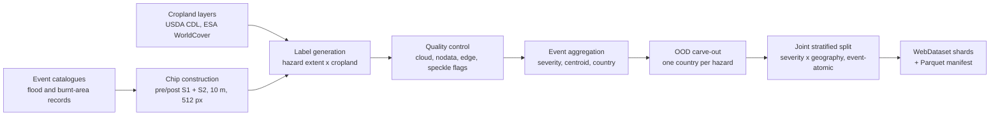
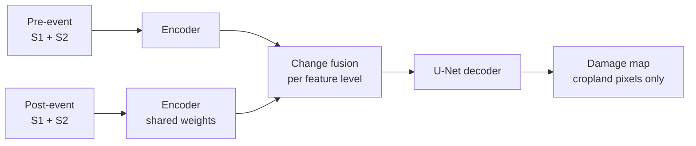

# CropDamage Benchmark

**A multi-hazard benchmark for mapping disaster damage to cropland with geospatial foundation models, evaluated on disaster events and regions the model has never seen.**

Disasters are mapped routinely; what they do to the land people depend on is not. Existing Earth-observation disaster datasets are fragmented by hazard, centred on buildings and urban damage (xBD, BRIGHT), or limited to flood and burn-scar *extent* with no link to what was growing underneath. The same gap persists in foundation-model evaluation: across GEO-Bench, PANGAEA and GEO-Bench-2, the recurring disaster tasks are flood, burn-scar and building-damage segmentation. Agricultural impact, the pathway through which most hazards reach food security, livelihoods and public health, is not represented.

CropDamage Benchmark addresses that gap. It pairs bi-temporal Sentinel-1 SAR and Sentinel-2 optical imagery with pixel-level labels of *damaged versus unaffected cropland*, across two hazards and roughly 2,760 globally distributed events, and it fixes an evaluation protocol whose central question is generalization: how well does a model trained on past events map damage from an event, or a country, it was never shown?

| | |
|---|---|
| **Hazards** | Flood, Burnt area (hazard-agnostic format; see [Extending the benchmark](#extending-the-benchmark)) |
| **Scale** | 9,888 chips from 2,760 events, 2020 to early 2026 |
| **Coverage** | 33 countries (Flood), 62 countries (Burnt) |
| **Inputs** | Pre- and post-event Sentinel-2 L2A (12 bands) and Sentinel-1 GRD (VV, VH), 10 m, 512 × 512 px |
| **Labels** | Per-pixel: damaged cropland, unaffected cropland, excluded cropland, non-cropland |
| **Splits** | Event-disjoint train / val / test, plus a whole-country out-of-distribution hold-out per hazard |
| **Models** | TerraMind, Prithvi-EO-2.0, CROMA, AlphaEarth Foundations (planned), and a U-Net trained from scratch |
| **Dataset** | [huggingface.co/datasets/eadrah/AgDamage_Benchmark](https://huggingface.co/datasets/eadrah/AgDamage_Benchmark) |

## Contents

1. [Design principles](#design-principles)
2. [Data preparation pipeline](#data-preparation-pipeline)
3. [Model design](#model-design)
4. [Experiments](#experiments)
5. [Extending the benchmark](#extending-the-benchmark)
6. [Reproducing the experiments](#reproducing-the-experiments)
7. [Repository layout](#repository-layout)

## Design principles

**Impact, not only extent.** Labels are the intersection of an observed hazard footprint with a cropland layer (USDA CDL, ESA WorldCover). A model is scored on whether it separates damaged from unaffected *cropland*; everything else is masked out of both the loss and the metrics.

**The unit of generalization is the event.** Chips cut from the same disaster share acquisition dates, phenology and terrain, so a random chip-level split leaks. Every split in this benchmark assigns whole events, and the headline metric is averaged over events rather than pixels.

**Two levels of "unseen".** The test split holds unseen events drawn from the same regions as training. A separate hold-out removes an entire country per hazard before any other split is made, and measures transfer to a region the model has no examples from.

**Hazard-agnostic by construction.** Every hazard is stored, split and loaded through the same schema, loader and model interface. Adding a hazard is a data task, not a code change.

**One protocol for every encoder.** Decoder, fusion module, input size, augmentation, loss, optimizer budget and model-selection rule are held constant, so differences in results reflect the pretrained representation.

## Data preparation pipeline



### Events and chips

Each sample is a **chip**: a co-registered 512 × 512 tile at 10 m carrying four rasters (Sentinel-1 and Sentinel-2, each before and after the event), a label raster, and a JSON sidecar. The five rasters and the sidecar are treated as one atomic sample throughout the pipeline.

| Hazard | Events | Chips | Countries | Event source (manifest tag) |
|---|---|---|---|---|
| Flood | 1,297 | 5,102 | 33 | `groundsource` (4,994 chips), Dartmouth Flood Observatory `dfo` (108 chips) |
| Burnt | 1,463 | 4,786 | 62 | `mcd64-cluster` (burned-area clusters) |

The sidecar and the manifest record provenance and context for every chip: event dates, source and confidence tier, country and continent, bounding box, cropland fraction, damaged-cropland fraction, crop phenology stage at the time of the event, per-image acquisition dates and clear-sky fraction, and a quality-control verdict (`clean`, `minor`, `cloudy`, `partial_edge`, `s1_unusable`, `s2_unusable`).

### Label semantics

Band 1 of the label raster holds four classes. Training uses a three-way remap so that only cropland contributes to the objective:

| Raw value | Meaning | Training class |
|---|---|---|
| 1 | Damaged cropland (flooded or burnt) | 2, positive |
| 2 | Unaffected cropland | 1, negative |
| 3 | Cropland excluded by quality control | 0, ignored |
| 4 | Non-cropland | 0, ignored |

A continuous target, the fraction of a chip's cropland that is damaged, is stored alongside the mask. It drives the severity stratification below and supports regression or severity-grading heads on the same imagery.

### Split protocol

Splits are computed once per hazard by [`data/input/stratification/repackage_agdamage.py`](data/input/stratification/repackage_agdamage.py) and [`update_split.py`](data/input/stratification/update_split.py), and are frozen in the manifest. Training code reads the split column and never re-derives it.

1. **Event aggregation.** Chips are grouped by event. Each event receives a severity score (the cropland-pixel-weighted mean of its chips' damaged fraction), a centroid, and a country.
2. **Out-of-distribution carve-out.** Candidate countries are ranked on three criteria: enough events to be informative, a severity distribution representative of the rest of the hazard (Wasserstein distance), and spatial isolation from all other events (minimum haversine distance). The selected country is removed in full before any other split: the **Philippines** for Flood and **South Africa** for Burnt.
3. **Joint stratified split.** The remaining events are divided 60 / 20 / 20 into train, validation and test. Strata are the cross of four severity quartiles and a coarse geographic bucket (continent-scale, with sparse regions pooled). Stratifying on severity alone left geography to chance, which on roughly 1,300 events produced measurable train/test shifts; coarse rather than fine geography is deliberate, because fine spatial cells risk placing adjacent events on opposite sides of a split.
4. **Leakage check.** The script fails if any event appears in more than one split, and records train/val/test severity distances in `split_summary.json` (Wasserstein distance between 0.007 and 0.015 for both hazards).

| Hazard | Train | Validation | Test | OOD hold-out |
|---|---|---|---|---|
| Flood, events | 767 | 258 | 251 | 21 |
| Flood, chips | 3,040 | 1,013 | 981 | 68 |
| Burnt, events | 863 | 288 | 290 | 22 |
| Burnt, chips | 2,835 | 927 | 953 | 71 |

### Distribution format

The raw dataset is tens of thousands of loose GeoTIFFs. For training it is repackaged into WebDataset shards with a Parquet manifest, which is what [`AgDamageShardDataset`](crop_damage/datasets/AgDamageShardDataset.py) reads.

```
<data_root>/<Hazard>/
├── manifest.parquet        # one row per chip: ids, split, severity, geography, QC, provenance
├── split_summary.json      # per-split counts, strata histograms, leakage check
├── severity_bin_ranges.csv # quartile boundaries used for stratification
├── ood_candidates.csv      # ranked hold-out candidates with their scores
└── shards/{train,val,test,ood_holdout}/<split>-NNNNNN.tar
```

Inside a shard, one chip is six members sharing a key: `<chip_id>.{s1_pre,s1_post,s2_pre,s2_post,label}.tif` and `<chip_id>.json`.

## Model design

Every model in the benchmark is the same three-stage network. Only the encoder changes.



**Siamese encoder.** The pre-event and post-event stacks pass through one encoder with shared weights. Foundation-model encoders are frozen by default, so the benchmark measures the quality of the pretrained representation; `encoder.finetune: true` switches to full fine-tuning.

| Encoder | Variant | Pretraining | Integration |
|---|---|---|---|
| TerraMind | `terramind_v1_base` | Multimodal generative (S1, S2 and more) | TerraTorch backbone registry |
| Prithvi-EO-2.0 | `prithvi_eo_v2_tiny_tl` | Masked autoencoding on HLS time series | TerraTorch backbone registry; six HLS-equivalent S2 bands plus VV/VH |
| CROMA | `croma_base` | Contrastive and masked, joint S1 + S2 | Official implementation vendored; per-layer features captured by forward hooks |
| AlphaEarth Foundations | Satellite Embedding | Multi-sensor embedding field model | Planned |
| U-Net | 5-level, trained from scratch | None | Non-foundation-model reference |

Each encoder has an input adapter that handles band selection and exposes a common interface (`decoder_spec`), so the training loop is model-agnostic.

**Change fusion.** Features from the two dates are combined independently at each selected encoder level. Five interchangeable operators are implemented in [`change_fusion.py`](crop_damage/models/change_fusion.py): signed difference, concatenation of before/after/difference, signed plus absolute difference, a learned Siamese projection, and bidirectional cross-attention between the two dates. The default configuration uses cross-attention fusion.

**Decoder.** A U-Net decoder ([`Decoder_UNet2D.py`](crop_damage/models/Decoder_UNet2D.py)) reshapes transformer tokens from five encoder blocks into a feature pyramid and decodes it to the input resolution.

For the TerraMind configuration the encoder holds 87.7 M frozen parameters; the trainable part is the fusion module (17.7 M) and the decoder (32.6 M).

**Known asymmetries across encoders.** CROMA tokenizes with a fixed 8-pixel patch, so its pyramid has four levels where the others have five, and it is run at 224 px rather than its 120 px pretraining resolution to keep input size identical across models. Both are stated limitations of the comparison.

## Experiments

### Tasks

**Task A, damage segmentation (implemented).** Per-pixel classification of cropland into damaged and unaffected, from the bi-temporal S1 + S2 pair.

**Task B, change detection (planned).** Prediction of the pre-to-post change mask as a separate target. The Siamese path and fusion operators it requires are already in place; the task definition and configs are not yet final.

### Training protocol

| Setting | Value |
|---|---|
| Input | 224 × 224 patches tiled from each 512 × 512 chip, standardised per patch |
| Modalities | Sentinel-2 L2A and Sentinel-1 GRD, both dates |
| Augmentation | Random flips and 90° rotations, applied identically to both dates and the label |
| Loss | Cross-entropy over cropland pixels (Dice, focal and class-weighted variants available) |
| Optimizer | Adam, `ReduceLROnPlateau` (factor 0.5), early stopping on validation loss |
| Model selection | Checkpoint with the lowest validation loss |

Chips without a usable Sentinel-1 acquisition are dropped when S1 is requested (about 2 to 3 % of chips), which is why evaluated chip counts are slightly below the manifest counts.

### Evaluation protocol

Predictions are stitched back to full chips, masked to cropland, and scored on the damaged-cropland class with IoU, F1, precision, recall and accuracy.

- **Event-macro (headline).** Metrics are computed per event from pooled pixel counts, then averaged over events. This weights a small event the same as a large one and is the number that reflects generalization. A 95 % confidence interval comes from a percentile bootstrap over events (2,000 resamples).
- **Micro.** Pixel counts pooled over the whole split, reported for comparison with pixel-level benchmarks.
- **Two evaluation sets per hazard.** The in-distribution test split (unseen events) and the country-level OOD hold-out (unseen region).

### Hyperparameter selection

Hyperparameters are chosen on the validation split only. Sweeps run with the test and OOD loaders disabled, so no test information can reach model selection; the selected checkpoint is evaluated on the held-out sets once, afterwards.

Each sweep is a W&B random search over learning rate (log-uniform, 1e-4 to 3e-3) and batch size (8 or 16), with Hyperband early termination and a fixed budget of 12 trials and 12 epochs per trial. The same search space and budget are applied to every encoder.

## Extending the benchmark

Nothing in the format, loader, split procedure or model interface is specific to floods, fire or crops. A new hazard needs four things:

1. An event catalogue with dates and footprints.
2. Pre- and post-event Sentinel-1 and Sentinel-2 chips over each event.
3. A label raster formed by intersecting the hazard footprint with an exposure layer.
4. One scalar per chip measuring how much of the exposed area is affected, used for severity stratification.

The repackaging and split scripts then produce an event-disjoint, severity- and geography-stratified split with a regional hold-out, and a new hazard directory is selected in a config with `hazards: [<Name>]`. Pooled and leave-one-hazard-out experiments follow from listing more than one hazard.

Two directions follow naturally from this design:

- **Further hazards.** Landslides and conflict-related damage are sudden-onset events that fit the bi-temporal format directly. Slow-onset and land-surface hazards, such as agricultural drought, crop failure, and the bare, desiccated cropland that becomes a source area for wind erosion and dust, share the same structure of a hazard footprint over an exposed land cover; they call for a longer pre-event temporal context than a single image pair, which the Siamese design extends to.
- **Further exposure layers.** The cropland mask is one choice of exposure layer. Replacing it with population, settlement or health-facility catchment layers turns the same pipeline from mapping agricultural damage into mapping where people are exposed, which is the input that risk-zone delineation for environmental-health studies requires.

## Reproducing the experiments

### Environment

The code was developed with Python 3.12, PyTorch 2.10, TerraTorch 1.1, Hydra 1.3, WebDataset 1.0, rasterio 1.4 and W&B 0.25.

```bash
git clone https://github.com/JulinaM/Crop-Damage-Benchmark.git
cd Crop-Damage-Benchmark
pip install torch torchvision terratorch hydra-core webdataset rasterio pandas pyarrow wandb
```

TerraMind and Prithvi weights are fetched through TerraTorch. CROMA weights (`CROMA_base.pt`) are downloaded once from the official release into `data/checkpoints/croma/`.

### Data

Download the dataset from Hugging Face, then build the splits and shards:

```bash
python data/input/stratification/update_split.py --root <path/to/AgDamage> --hazards Flooded \
    --strata-mode joint --ood-regions '{"Flooded": ["Philippines"]}' --reshard
python data/input/stratification/update_split.py --root <path/to/AgDamage> --hazards Burnt \
    --strata-mode joint --ood-regions '{"Burnt": ["South Africa"]}' --reshard
```

Point `data_root` in the configs at the resulting `<root>_resharded/` directory.

### Train and evaluate

```bash
# single run: trains, then evaluates the best checkpoint on test and OOD
python -m crop_damage --config-name=segmentation/terramind_flood

# any setting can be overridden from the command line
python -m crop_damage --config-name=segmentation/terramind_burnt model.learning_rate=1e-4 trainer.n_epochs=12
```

### Hyperparameter search

```bash
wandb sweep sweeps/terramind_flood.yaml          # prints <entity>/<project>/<sweep_id>
wandb agent --count 1 <entity>/<project>/<sweep_id>

# evaluate the sweep's best run on the held-out sets
python -m crop_damage.utils.best_sweep_run <entity>/<project>/<sweep_id>
python -m crop_damage.utils.eval_checkpoint <run_dir> configs/segmentation/terramind_flood.yaml
```

The scripts in [`slurm/`](slurm/) wrap these commands for a SLURM cluster (`sweep_agent.slurm` runs one trial per array task; `eval_sweep_best.slurm` evaluates the winner). They contain site-specific paths and module names that need adapting.

### Figures and tables

```bash
python -m crop_damage.utils.collect_loho_results data/experiments --out report.csv
```

[`crop_damage/examples/3_reconstruct_test_tiles.ipynb`](crop_damage/examples/3_reconstruct_test_tiles.ipynb) renders the three-panel figures from saved predictions.

## Repository layout

```
crop_damage/
├── main.py                  # Hydra entry point: data, model, training, evaluation
├── Trainer.py               # training loop, early stopping, checkpointing, logging
├── Evaluator.py             # tile reconstruction, event-macro metrics, bootstrap CIs, GeoTIFFs
├── datasets/                # AgDamageShardDataset: shard reader, patching, augmentation
├── models/                  # encoders and input adapters, change fusion, U-Net decoder
├── utils/                   # losses, checkpoint evaluation, sweep selection, figures
└── examples/                # notebooks: chip inspection, hold-out demo, figure rendering
configs/
├── base.yaml                # shared defaults
├── dataset/                 # per-hazard data groups (flood, burnt, pooled)
└── segmentation/            # one config per encoder and hazard, plus sweep variants
sweeps/                      # W&B sweep definitions
slurm/                       # cluster launch scripts
data/input/stratification/   # repackaging, OOD selection and split scripts; analysis notebooks
dataset_construction/        # raw-data collection notes
```

## Acknowledgements

This work builds on [TerraMind](https://github.com/IBM/terramind), [Prithvi-EO-2.0](https://github.com/NASA-IMPACT/Prithvi-EO-2.0), [CROMA](https://github.com/antofuller/CROMA) and [TerraTorch](https://github.com/IBM/terratorch), and on data from the Copernicus Sentinel-1 and Sentinel-2 missions. The evaluation design draws on [PANGAEA](https://github.com/VMarsocci/pangaea-bench) and GEO-Bench. The codebase originated from [DamageMappingTerramind](https://github.com/JulinaM/DamageMappingTerramind).

## License

Code is released under the MIT license. The vendored CROMA implementation retains its original MIT license.
